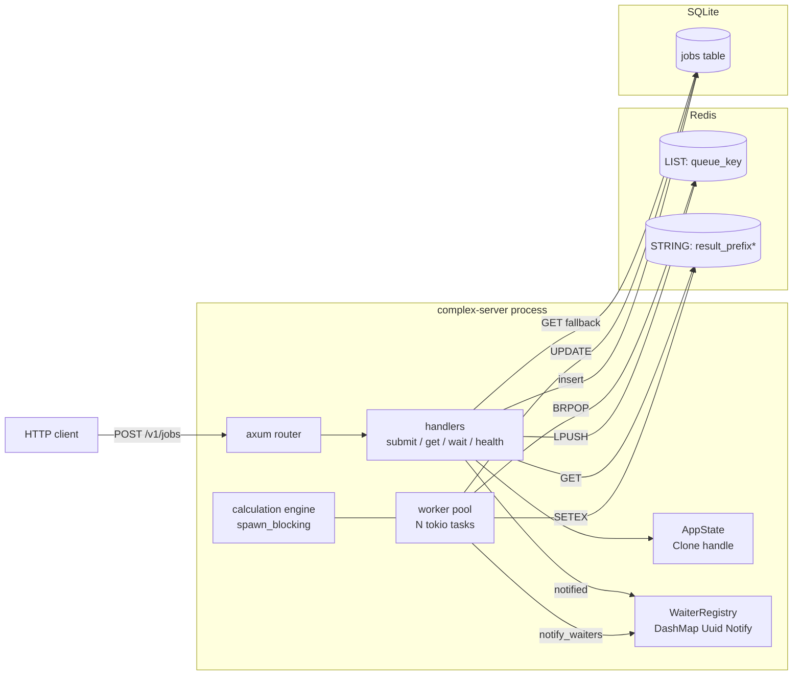
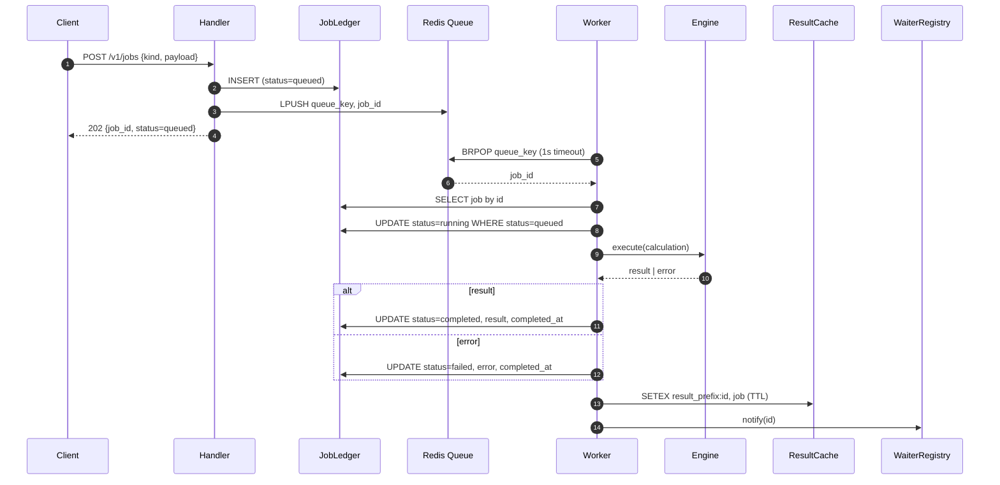
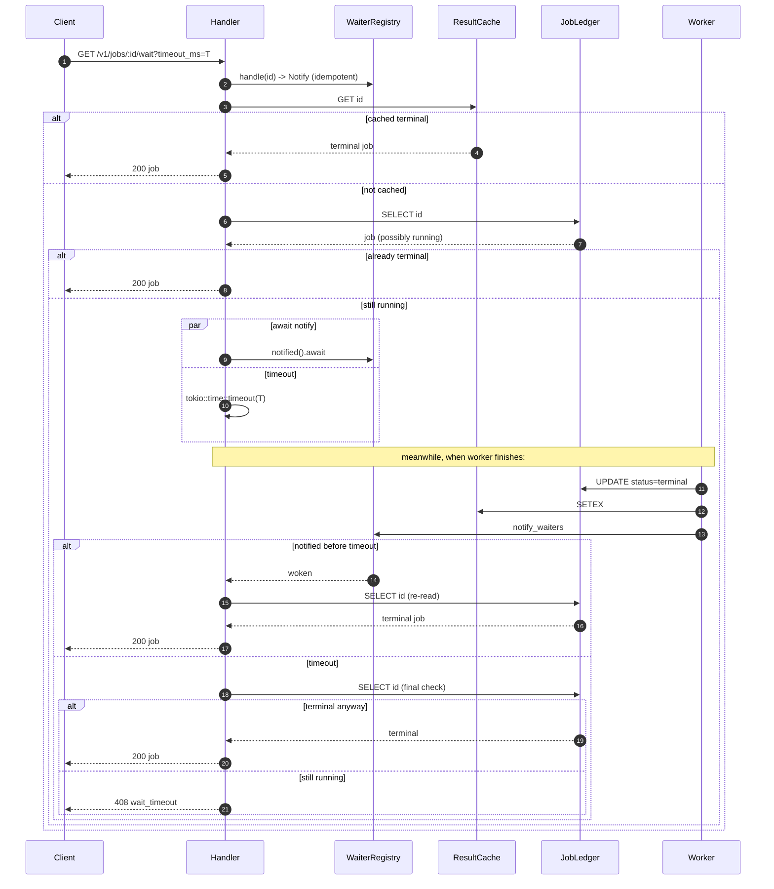

# complex-server — design

A single-process, tokio-based job server that accepts calculation requests, runs them asynchronously through a Redis-backed queue, persists every state transition to SQLite, and exposes both poll and long-poll endpoints to clients. This document is the why behind the code.

## Goals

- Submit a job over HTTP, get a UUID back immediately, never block the caller on the computation.
- Run CPU-bound and IO-bound calculations concurrently without starving the reactor.
- Survive process restarts without losing queued or in-flight work.
- Let clients either poll status cheaply or long-poll for the result with a bounded timeout.
- Run end-to-end on a developer laptop with one external dep (Redis), no cloud, no subscription.

## Non-goals

- Multi-process scale-out. The wake-up notification path is in-process; running N replicas would require swapping that for Redis pub/sub.
- Authentication, rate limiting, or quota enforcement. Those belong in a gateway in front of this service.
- Schedulable / cron-style jobs. The queue is FIFO, no delayed dispatch.

## Architecture at a glance



Three runtime objects matter most:

1. **`AppState`** — a `Clone` handle holding `JobLedger`, `JobQueue`, `ResultCache`, `WaiterRegistry`. Each inner type wraps an `Arc` so cloning is cheap reference counting. Axum requires `State` to be `Clone`; this is the seam.
2. **Worker pool** — N tokio tasks (default 4) that loop on `BRPOP`, drive jobs through the engine, and write results back.
3. **`WaiterRegistry`** — `DashMap<Uuid, Arc<Notify>>` to wake long-poll clients the instant a job finishes.

## Why these tools

### Redis as queue + cache

The brief says "RabbitMQ or Redis" and the result cache lives in Redis already. Two backends would be two TCP failure modes, two health checks, two persistence stories. One backend with disjoint key namespaces (`complex-server:queue` vs `complex-server:result:*`) is enough for this scale.

`LPUSH` + `BRPOP` is FIFO and atomic. `BRPOP` blocks server-side so the worker doesn't busy-poll; the timeout argument is what lets us cancel mid-block during shutdown.

Tradeoffs we accept:
- No native priorities or delayed dispatch. If we need them, switch to RabbitMQ or Redis Streams + consumer groups.
- No native at-least-once redelivery on worker crash mid-task. The job lives in the ledger; a `started_at IS NOT NULL AND completed_at IS NULL` recovery sweep on boot would catch orphans. Not implemented; called out below as future work.

### SQLite as ledger

A real DB for in-memory data would be overkill for a single-node app. SQLite is a file, has zero ops, and with WAL mode handles concurrent readers fine. sqlx gives us a real query API, compile-time-checked migrations, and a connection pool — same ergonomics as Postgres. If we outgrew the single-node assumption, the schema migrates trivially.

WAL mode + `synchronous = NORMAL` is the right balance: durable across process crashes (WAL fsync on commit), fast enough that the ledger isn't the bottleneck. The job table has indexes on `status` and `created_at` for future recovery sweeps and admin queries.

### In-process Notify map

`tokio::sync::Notify` is a permitless wakeup primitive — perfect for "the thing you asked about is done, go re-read it." `DashMap` is a sharded concurrent hash map so handlers and workers never contend on a global mutex.

Tradeoff: this only works inside one process. If we ran two replicas, a `/wait` on replica A wouldn't see a worker complete on replica B. The fallback would be Redis pub/sub on `complex-server:events:<job_id>`. The wait endpoint code is small and isolated; swapping it later is one focused commit.

### Tokio runtime + `spawn_blocking`

`tokio::main` gives us a multithreaded reactor. Async tasks (HTTP handlers, BRPOP loop, sleep) live there. CPU-bound math (fibonacci on BigUint, prime factorization, matrix multiply) lives on the **blocking thread pool** via `tokio::task::spawn_blocking`. Mixing those up is the classic Tokio footgun — a tight CPU loop without an `.await` blocks an executor thread and stalls every other task on it.

The engine encapsulates this discipline: the public `execute(calculation)` is async; CPU variants internally hand off to `spawn_blocking`, IO variants stay on the reactor.

## Job lifecycle

```
queued ──> running ──> completed
                  └──> failed
```

`is_terminal()` is true for `completed` and `failed`. Once terminal, the row is immutable.

State transitions, all guarded:

| transition          | guard                    | actor    |
|---------------------|--------------------------|----------|
| insert -> queued    | id is fresh UUID         | handler  |
| queued -> running   | `WHERE status='queued'`  | worker   |
| running -> completed| unconditional UPDATE     | worker   |
| running -> failed   | unconditional UPDATE     | worker   |

The `queued -> running` guard makes the transition safe under worker crash retry: a second worker can't accidentally re-enter a job mid-flight. (We don't currently re-queue on worker crash, but the guard means it would be safe.)

## Sequence: submit + worker dispatch



Every state-changing line is durable in SQLite before the cache or notifier sees it. If we crash after the SQLite UPDATE but before the SETEX, the cache is just cold; the next `GET /v1/jobs/:id` reads from the ledger and back-fills the cache.

## Sequence: long-poll `/wait`

The interesting case. Two failure modes to avoid:
- **Race A**: the job finishes *after* we check the ledger but *before* we register the Notify handle. We'd then await a Notify that never fires.
- **Race B**: the timeout fires at the same instant the worker notifies. We can't tell which won.

The code uses the **arm-then-check** pattern to kill Race A, and a final ledger re-read to break ties for Race B.



The order of operations the handler runs is exactly:

```rust
let notify = state.waiters.handle(id);       // 1. arm
let job = load_job(&state, id).await?;       // 2. check
if job.status.is_terminal() { return Ok(job); }
let notified = notify.notified();            // 3. await future
tokio::time::timeout(timeout, notified).await
```

Step 1 *must* precede step 2. If we checked first and armed second, the worker could complete and notify in the gap, and our subsequent `notified().await` would block forever (no permits, no future caller to wake us).

The post-timeout re-read closes the second race. If the worker finished and notified at the same instant the timeout expired, both branches of the `select`-like `timeout` may have raced; the ledger is the tiebreaker.

## Sequence: graceful shutdown

```mermaid
sequenceDiagram
  participant OS as OS
  participant S as shutdown task
  participant T as CancellationToken
  participant A as axum
  participant W as workers
  participant Q as Redis Queue

  OS->>S: SIGINT or SIGTERM
  S->>T: cancel()
  par axum drain
    A->>A: stop accepting; finish in-flight
  and worker drain
    W->>Q: BRPOP returns (1s timeout)
    W->>T: is_cancelled? yes
    W->>W: exit loop
  end
  A-->>main: serve returns
  W-->>main: join handles complete
  main->>main: log shutdown complete; exit 0
```

The cancel token is the single source of truth. Cloning it across N workers + 1 axum server gives every component a coordinated stop signal without sharing mutable state.

The BRPOP timeout of 1 second sets the worst-case shutdown latency: workers re-check `cancel.is_cancelled()` at most once per second. `worker.shutdown_grace_seconds` (default 30) bounds the wait on in-flight jobs.

## Consistency between SQLite and Redis

The ledger is the source of truth. Redis is a perf layer:

- The queue is best-effort. If Redis loses the LIST contents (FLUSHDB, persistence misconfig, OOM eviction), queued jobs would be orphaned in SQLite. A recovery sweep on boot (`SELECT id FROM jobs WHERE status='queued'` -> `LPUSH` each) would restore them. Not implemented; tracked below.
- The cache is best-effort. Every read path falls back to SQLite on miss; cache eviction is harmless.
- Writes go to SQLite *first*, then Redis cache, then the Notify wakeup. If the process dies between SQLite and Redis, the next read repairs the cache.

There is one durability gap worth naming: a job marked `running` whose worker dies before writing a terminal state stays `running` forever in the ledger. A boot-time sweep that resets `running` back to `queued` (and re-pushes) would close this. Documented as future work.

## Backpressure and limits

- HTTP requests have a 120s tower-http timeout layer.
- `/wait` caps `timeout_ms` server-side at 60s regardless of client input.
- Calculations have per-variant input bounds (`MAX_FIB_N`, `MAX_PRIME_N`, `MAX_MATRIX_DIM`, `MAX_SLEEP_MS`). The intent is preventing one request from monopolizing a worker, not safety.
- The worker pool is sized via `worker.concurrency`. The Redis pool (`redis.pool_size`) should be at least `concurrency + 4` to give handlers connections too — the default 16 covers the default 4 workers comfortably.

We do not enforce a max queue depth; this is single-tenant. In a real deployment you'd reject submits at some threshold and have clients back off.

## Configuration model

`config/default.toml` ships baked-in defaults. `AppConfig::load()` reads it, then layers env-var overrides with the convention `COMPLEX_SERVER__<SECTION>__<FIELD>`. This is the standard 12-factor pattern: code carries sensible defaults, deployment carries secrets and tuning.

| key                                   | env override                              |
|---------------------------------------|-------------------------------------------|
| `server.bind`                         | `COMPLEX_SERVER__SERVER__BIND`            |
| `database.url`                        | `COMPLEX_SERVER__DATABASE__URL`           |
| `redis.url`                           | `COMPLEX_SERVER__REDIS__URL`              |
| `redis.pool_size`                     | `COMPLEX_SERVER__REDIS__POOL_SIZE`        |
| `worker.concurrency`                  | `COMPLEX_SERVER__WORKER__CONCURRENCY`     |

## Observability

`tracing` everywhere; `tracing_subscriber` with `EnvFilter` so log levels are runtime-controllable via `RUST_LOG`. tower-http's `TraceLayer` emits a span per HTTP request. Worker logs carry `worker_id` and `job_id` as structured fields, which is the discipline that makes log aggregation usable later.

`/healthz` returns queue depth so a load balancer can answer "is this process actually doing work, or just bound to a port?".

## What I'd add next

Roughly in priority order:

1. **Boot recovery sweep**: on startup, find `running` rows with no `completed_at`, reset to `queued`, re-enqueue. Closes the worker-crash gap.
2. **Idempotency key on submit**: an `Idempotency-Key` header maps to a job id; resubmission returns the original. Important for retrying clients.
3. **Per-tenant queues**: hash a header into the queue key. Trivial change, isolates noisy neighbours.
4. **Metrics**: Prometheus exposition via `metrics-exporter-prometheus`. Queue depth, p50/p99 wait time, in-flight per worker.
5. **Multi-replica wake**: swap the in-process `WaiterRegistry` for Redis pub/sub. The handler subscribes to `events:<job_id>` before the ledger check; workers `PUBLISH` after the cache write. The arm-then-check pattern stays identical.
6. **Result streaming**: replace `/wait` with SSE on `/v1/jobs/:id/stream` for jobs whose engine emits incremental progress.

## File map

```
src/
  main.rs            init tracing -> load config -> connect ledger -> build redis pool ->
                     build state -> spawn workers -> bind tcp -> axum::serve with
                     graceful_shutdown -> drain workers
  lib.rs             module roots and re-exports
  config.rs          AppConfig + env overrides
  error.rs           AppError + IntoResponse + status mapping
  state.rs           AppState clone-handle
  shutdown.rs        SIGINT/SIGTERM -> CancellationToken.cancel()

  domain/
    calculation.rs   Calculation, CalculationResult enums (adjacently tagged)
    job.rs           Job, JobStatus, terminal predicate
    engine.rs        execute(); CPU on spawn_blocking, IO on reactor

  storage/
    ledger.rs        JobLedger (sqlx + sqlite), embedded migrations
    cache.rs         ResultCache (redis SETEX)

  queue/
    redis_queue.rs   JobQueue (LPUSH / BRPOP), deadpool pool builder

  worker/
    pool.rs          spawn() N workers, BRPOP loop with cancel, process_one

  notify/
    waiters.rs       WaiterRegistry (DashMap<Uuid, Arc<Notify>>)

  http/
    routes.rs        axum Router + TraceLayer + TimeoutLayer
    handlers.rs      submit, get_job, wait_job, health
    dto.rs           wire-format types

migrations/
  0001_init.sql      jobs table + indexes

config/
  default.toml       baked-in defaults
```

## Wire-format reference

### POST /v1/jobs

Request:

```json
{ "kind": "fibonacci", "payload": { "n": 100 } }
```

Response (`202 Accepted`):

```json
{ "job_id": "uuid", "status": "queued" }
```

Variants:

| kind             | payload                                | result                            |
|------------------|----------------------------------------|-----------------------------------|
| `fibonacci`      | `{ "n": u64 }`                         | `{ "number": "decimal-string" }`  |
| `prime_factors`  | `{ "n": u64 }`                         | `{ "factors": [u64, ...] }`       |
| `matrix_multiply`| `{ "a": [[f64]], "b": [[f64]] }`       | `{ "matrix": [[f64]] }`           |
| `sleep`          | `{ "ms": u64 }`                        | `{ "slept_ms": u64 }`             |

### GET /v1/jobs/:id

Returns the full job:

```json
{
  "id": "uuid",
  "calculation": { "kind": "...", "payload": { ... } },
  "status": "queued | running | completed | failed",
  "created_at": "rfc3339",
  "started_at": "rfc3339 | null",
  "completed_at": "rfc3339 | null",
  "result": { "kind": "...", "...": ... } | null,
  "error": "string | null"
}
```

### GET /v1/jobs/:id/wait?timeout_ms=N

Same body as GET when terminal. `408 Request Timeout` with `{"error":"wait_timeout","message":"wait timed out"}` if the timeout expired before the job finished. `timeout_ms` defaults to 5000, capped at 60000.

### GET /healthz

```json
{ "status": "ok", "queue_depth": 0 }
```

### Error envelope

All non-2xx responses:

```json
{ "error": "machine_code", "message": "human-readable" }
```

with `error` in `{job_not_found, bad_request, wait_timeout, database_error, redis_error, serialization_error, internal_error}`.
